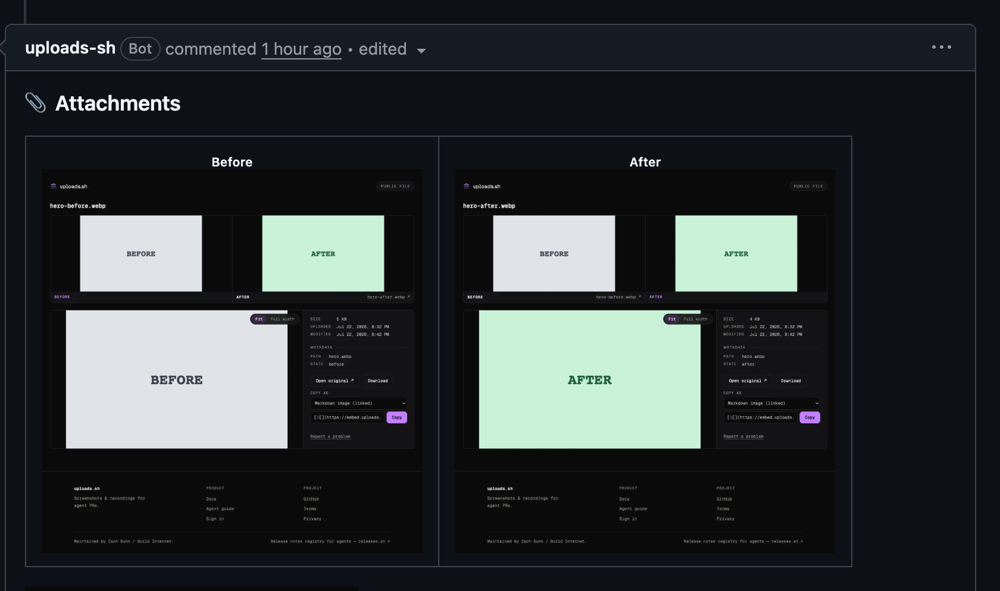

<div align="center">


<h1>uploads</h1>

**The missing upload command for coding agents.**

A lightweight file-hosting service on Cloudflare Workers. Agents capture
screenshots as they work — each one staged to the branch automatically — so by
the time the PR opens it is already furnished with one tidy attachments
comment. Built on [files-sdk](https://files-sdk.dev) so the storage layer is
provider-agnostic (R2 today; any files-sdk adapter later).

<p>
  <a href="https://uploads.sh"><b>uploads.sh</b></a> &nbsp;·&nbsp;
  <a href="docs/"><b>Docs</b></a> &nbsp;·&nbsp;
  <a href="https://www.npmjs.com/package/@buildinternet/uploads"><b>npm →</b></a> &nbsp;·&nbsp;
  <a href="#use-it">Use it</a> &nbsp;·&nbsp;
  <a href="#what-it-looks-like">What it looks like</a> &nbsp;·&nbsp;
  <a href="#whats-in-this-repo">What's in this repo</a> &nbsp;·&nbsp;
  <a href="#local-development">Develop</a>
</p>

<p>
  <a href="https://skills.sh/buildinternet/uploads"></a>
  <a href="https://github.com/buildinternet/uploads/actions/workflows/ci.yml"></a>
  <a href="https://www.npmjs.com/package/@buildinternet/uploads"></a>
  <a href="https://deepwiki.com/buildinternet/uploads"></a>
  <a href="LICENSE"></a>
</p>

<p><sub>
  <b>Under active development.</b> uploads.sh is being built in the open, so
  APIs (including auth) can still change. Feedback is welcome — open an issue.
</sub></p>

</div>

---

## What is this?

You add a screenshot to GitHub by dragging it into the comment box. Agents
can't — GitHub's native image hosting only works through a browser session, so
an agent that just captured a before/after has nowhere to put it.

**uploads** gives agents that missing step, and it works while the branch is
still in progress. An agent runs `uploads put ./after.png` the moment a change
is visible; on a branch that stages the file automatically — no PR required, no
flag to remember. Capture at every milestone and there is nothing to reassemble
at the end: when the PR opens, everything staged is promoted into a single
managed attachments comment.

Keys are hash-free, so re-uploading the same filename overwrites in place and
the URL never changes — every embed of it updates at once. Workspaces keep
tenants (and their budgets and key policies) apart.

This repo is the source of the canonical deployment at
[uploads.sh](https://uploads.sh): the API worker, auth worker, MCP server, the
Astro web app, and the `@buildinternet/uploads` CLI (published to npm from
[`packages/uploads`](packages/uploads)).

## What it looks like

One comment per PR, rewritten in place on every sync. Files tagged
`--state before` and `--state after` pair into a side-by-side table; anything
else lands below it.

<div align="center">
  <a href="https://github.com/buildinternet/uploads/pull/436#issuecomment-5052307515"></a>
</div>

<sub>The real comment on
[#436](https://github.com/buildinternet/uploads/pull/436#issuecomment-5052307515).</sub>

Pairing is by `--meta path=…` when several pairs share a comment (one `before`
and one `after` per path), and falls back to filenames that differ only by a
`before`/`after` token — `hero-before.webp` with `hero-after.webp`.

## Use it

Install the CLI and sign in once:

```bash
npm install --global @buildinternet/uploads
uploads login
```

Then capture as you work. On a branch, a bare `put` stages the file against
that branch — no PR needed yet, and no flag to remember:

```bash
uploads put ./before.png --state before
uploads put ./after.png --state after
uploads staged                 # what's queued, and whether it will auto-attach
```

Open the PR however you normally would (`gh pr create`, the GitHub UI) and the
staged files promote themselves into one managed attachments comment —
instantly if the [GitHub App](https://uploads.sh/docs/github-app) is installed,
otherwise on your next `uploads attach` (or `uploads attach --promote`).

Already have a PR or issue open? Target it directly, no staging step:

```bash
uploads attach ./before.png ./after.png
```

`attach` detects the repository and current PR through `gh`, uploads all files,
and creates or updates that same one comment. Both commands run under `npx
@buildinternet/uploads …` without a global install.

Sign in with GitHub or a magic link, then create your own workspace or accept
an invite into one — see [enrollment](docs/enrollment.md). Hosted files are
public, including media attached to private repositories. Do not upload secrets
or sensitive UI.

**Teach your agent the loop.** `uploads install` wires in the agent skills and
the MCP server, so future sessions capture at each visual milestone on their
own instead of being asked. The skills also install standalone, into any agent
runtime, without checking anything out:

```bash
npx skills add buildinternet/uploads
```

That installs both: `github-screenshots` (visuals → PRs/issues) and
`uploads-cli` (full CLI reference).

Full CLI usage — key conventions, stable PR/issue attachments, managed
comments, and public galleries — lives in [docs/cli.md](docs/cli.md). REST
routes are in [docs/api.md](docs/api.md).

## What's in this repo

| Path                         | What                                                      |
| ---------------------------- | --------------------------------------------------------- |
| `apps/api/`                  | Hono worker — REST API, deploys to `api.uploads.sh`       |
| `apps/auth/`                 | Better Auth worker — sessions, enrollment, device flow    |
| `apps/mcp/`                  | Remote MCP server                                         |
| `apps/web/`                  | Astro site — uploads.sh, account and admin UI             |
| `packages/storage/`          | `@uploads/storage` — files-sdk adapter factory            |
| `packages/uploads/`          | `@buildinternet/uploads` — CLI + client, publishes to npm |
| `packages/ui/`               | `@uploads/ui` — shared design system                      |
| `packages/billing/`          | `@uploads/billing` — plans and limit resolution           |
| `packages/email/`            | `@uploads/email` — transactional email templates          |
| `packages/errors/`           | `@uploads/errors` — shared error codes and wire format    |
| `skills/github-screenshots/` | Workflow skill — visuals into PRs/issues/share links      |
| `skills/uploads-cli/`        | Agent skill for driving the CLI                           |
| `plugins/claude/`            | Claude Code plugin — skills, MCP, pre-PR screenshot hook  |

The workers and web app are separate deployables. All storage access goes
through `createStorage()` in `packages/storage` — adding a provider is one new
case plus peer deps, no API changes.

## Docs

| Doc                                          | Contents                                            |
| -------------------------------------------- | --------------------------------------------------- |
| [cli](docs/cli.md)                           | CLI usage, GitHub embeds, keys, galleries           |
| [api](docs/api.md)                           | REST routes                                         |
| [local-dev](docs/local-dev.md)               | Manual setup, dev stack, smoke tests                |
| [workspaces](docs/workspaces.md)             | Multi-tenant model, budgets, key policy, BYO-bucket |
| [enrollment](docs/enrollment.md)             | Agent login, scopes, expiry, and migration          |
| [admin-tokens](docs/admin-tokens.md)         | Minting, listing, and revoking upload tokens        |
| [deletion](docs/deletion.md)                 | Workspace soft delete, grace period, and restore    |
| [ops](docs/ops.md)                           | Operator runbook (limits, retention, secrets)       |
| [deploy](docs/deploy.md)                     | Cloudflare setup and production deploy              |
| [releasing](docs/releasing.md)               | Changesets and publishing the CLI to npm            |
| [contract testing](docs/contract-testing.md) | Deployed smoke checks and release gate              |
| [roadmap](docs/roadmap.md)                   | Planned features                                    |

Agent and contributor conventions live in [AGENTS.md](AGENTS.md).

## Local development

**Prerequisites:** Node ≥24 and pnpm ≥11 (`corepack enable`). No Cloudflare
account needed for the core local loop — `wrangler dev` simulates R2, KV, and
D1 on disk:

```bash
pnpm bootstrap        # one-command setup: tooling, deps, env vars, local D1, default workspace
pnpm doctor           # diagnose the setup — reports what's missing and how to fix it

pnpm dev              # API on :8787 (local R2 + KV + D1)
pnpm dev:stack        # authenticated Auth + API + Web stack at https://uploads.localhost
pnpm check            # lint + format (the CI gate)
pnpm typecheck        # wrangler types + tsc across workspaces
```

`bootstrap` is idempotent (safe to re-run; never overwrites your env files or
re-mints an existing local workspace) and `doctor` is read-only. Manual setup
steps, the full dev-stack detail, and a curl smoke test live in
[docs/local-dev.md](docs/local-dev.md).

## License

[Apache 2.0](LICENSE).
