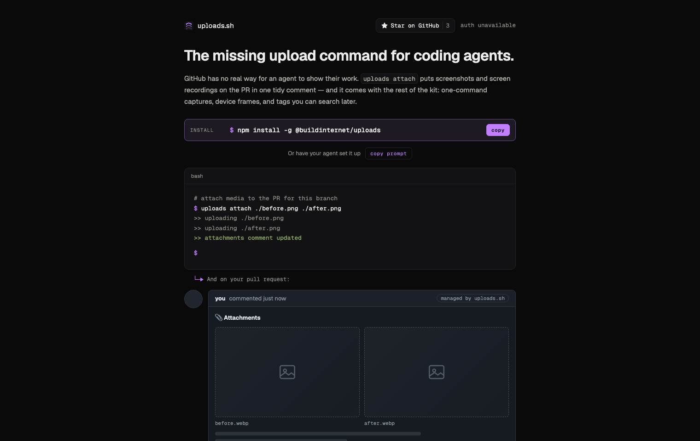

<div align="center">



<h1>uploads</h1>

**The missing upload command for coding agents.**

A lightweight file-hosting service on Cloudflare Workers. One command —
`uploads attach` — hosts a file at a stable public URL and keeps one tidy
attachments comment on the PR. Built on [files-sdk](https://files-sdk.dev) so
the storage layer is provider-agnostic (R2 today; any files-sdk adapter later).

<p>
  <a href="https://uploads.sh"><b>uploads.sh</b></a> &nbsp;·&nbsp;
  <a href="docs/"><b>Docs</b></a> &nbsp;·&nbsp;
  <a href="https://www.npmjs.com/package/@buildinternet/uploads"><b>npm →</b></a> &nbsp;·&nbsp;
  <a href="#use-it">Use it</a> &nbsp;·&nbsp;
  <a href="#whats-in-this-repo">What's in this repo</a> &nbsp;·&nbsp;
  <a href="#local-development">Develop</a>
</p>

<p>
  <a href="https://skills.sh/buildinternet/uploads"></a>
  <a href="https://github.com/buildinternet/uploads/actions/workflows/ci.yml"></a>
  <a href="https://www.npmjs.com/package/@buildinternet/uploads"></a>
  <a href="https://deepwiki.com/buildinternet/uploads"></a>
  <a href="LICENSE"></a>
</p>

<p><sub>
  <b>Active development — not production-ready.</b> uploads.sh is being built in
  the open and its APIs (including auth) will change without notice. Don't rely
  on it for anything you can't afford to lose or re-key.
</sub></p>

</div>

---

## What is this?

You add a screenshot to GitHub by dragging it into the comment box. Agents
can't — GitHub's native image hosting only works through a browser session, so
an agent that just captured a before/after has nowhere to put it.

**uploads** gives agents that missing step: a CLI and REST API that host files
at stable, public URLs and return ready-to-paste Markdown. `--pr`/`--issue`
keys are hash-free, so re-uploading the same filename overwrites in place and
the URL never changes, and a managed attachments comment keeps every file for
a PR in one tidy place. Workspaces keep tenants (and their budgets and key
policies) apart.

This repo is the source of the canonical deployment at
[uploads.sh](https://uploads.sh): the API worker, auth worker, MCP server, the
Astro web app, and the `@buildinternet/uploads` CLI (published to npm from
[`packages/uploads`](packages/uploads)).

## Use it

Install the CLI, sign in once, then attach media from a checked-out PR branch:

```bash
npm install --global @buildinternet/uploads
uploads login
uploads attach ./before.png ./after.png
```

For a one-off run without a global install:

```bash
npx @buildinternet/uploads login
npx @buildinternet/uploads attach ./before.png ./after.png
```

`attach` detects the GitHub repository and current PR through `gh`, uploads
all files, and creates or updates one managed attachments comment.

An uploads.sh administrator invites your email to a workspace; `uploads login`
opens a browser to sign in (GitHub or a magic link) and saves the resulting
workspace token — see [enrollment](docs/enrollment.md). Hosted files are
public, including media attached to private repositories. Do not upload
secrets or sensitive UI.

**Agent skills** — auto-triggering playbooks, installable into any agent
runtime without checking out anything (`uploads install` runs these for you):

```bash
npx skills add buildinternet/uploads
```

That installs both: `github-screenshots` (visuals → PRs/issues) and
`uploads-cli` (full CLI reference).

Full CLI usage — key conventions, stable PR/issue attachments, managed
comments, and public galleries — lives in [docs/cli.md](docs/cli.md). REST
routes are in [docs/api.md](docs/api.md).

## What's in this repo

| Path                         | What                                                      |
| ---------------------------- | --------------------------------------------------------- |
| `apps/api/`                  | Hono worker — REST API, deploys to `api.uploads.sh`       |
| `apps/auth/`                 | Better Auth worker — sessions, enrollment, device flow    |
| `apps/mcp/`                  | Remote MCP server                                         |
| `apps/web/`                  | Astro site — uploads.sh, account and admin UI             |
| `packages/storage/`          | `@uploads/storage` — files-sdk adapter factory            |
| `packages/uploads/`          | `@buildinternet/uploads` — CLI + client, publishes to npm |
| `packages/ui/`               | `@uploads/ui` — shared design system                      |
| `skills/github-screenshots/` | Workflow skill — visuals into PRs/issues/share links      |
| `skills/uploads-cli/`        | Agent skill for driving the CLI                           |

The workers and web app are separate deployables. All storage access goes
through `createStorage()` in `packages/storage` — adding a provider is one new
case plus peer deps, no API changes.

## Docs

| Doc                                          | Contents                                            |
| -------------------------------------------- | --------------------------------------------------- |
| [cli](docs/cli.md)                           | CLI usage, GitHub embeds, keys, galleries           |
| [api](docs/api.md)                           | REST routes                                         |
| [local-dev](docs/local-dev.md)               | Manual setup, dev stack, smoke tests                |
| [workspaces](docs/workspaces.md)             | Multi-tenant model, budgets, key policy, BYO-bucket |
| [enrollment](docs/enrollment.md)             | Agent login, scopes, expiry, and migration          |
| [admin-tokens](docs/admin-tokens.md)         | Minting, listing, and revoking upload tokens        |
| [ops](docs/ops.md)                           | Operator runbook (limits, retention, secrets)       |
| [deploy](docs/deploy.md)                     | Cloudflare setup and production deploy              |
| [contract testing](docs/contract-testing.md) | Deployed smoke checks and release gate              |
| [roadmap](docs/roadmap.md)                   | Planned features                                    |

Agent and contributor conventions live in [AGENTS.md](AGENTS.md).

## Local development

**Prerequisites:** Node ≥24 and pnpm ≥11 (`corepack enable`). No Cloudflare
account needed for the core local loop — `wrangler dev` simulates R2, KV, and
D1 on disk:

```bash
pnpm bootstrap        # one-command setup: tooling, deps, env vars, local D1, default workspace
pnpm doctor           # diagnose the setup — reports what's missing and how to fix it

pnpm dev              # API on :8787 (local R2 + KV + D1)
pnpm dev:stack        # authenticated Auth + API + Web stack at 127.0.0.1:4321
pnpm check            # lint + format (the CI gate)
pnpm typecheck        # wrangler types + tsc across workspaces
```

`bootstrap` is idempotent (safe to re-run; never overwrites your env files or
re-mints an existing local workspace) and `doctor` is read-only. Manual setup
steps, the full dev-stack detail, and a curl smoke test live in
[docs/local-dev.md](docs/local-dev.md).

## License

[MIT](LICENSE).
