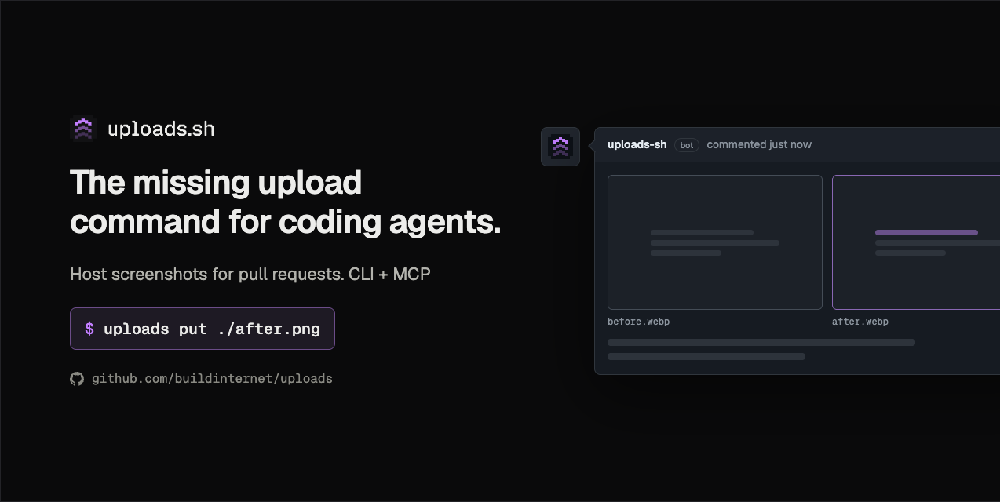
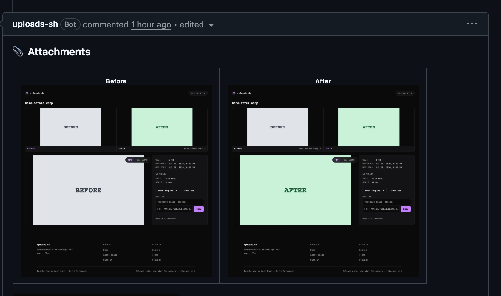
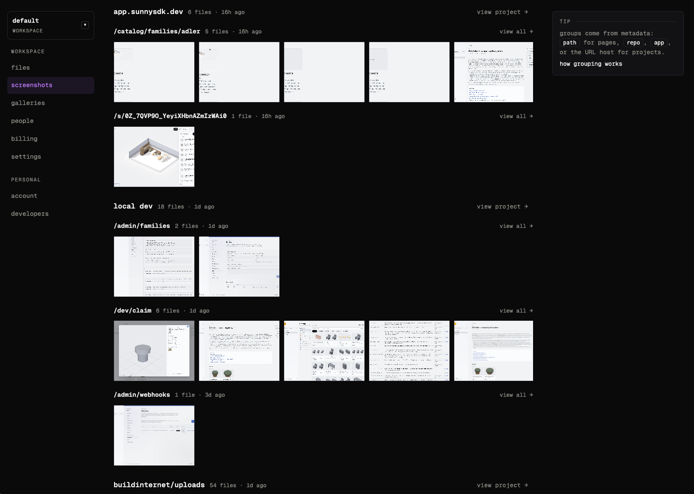
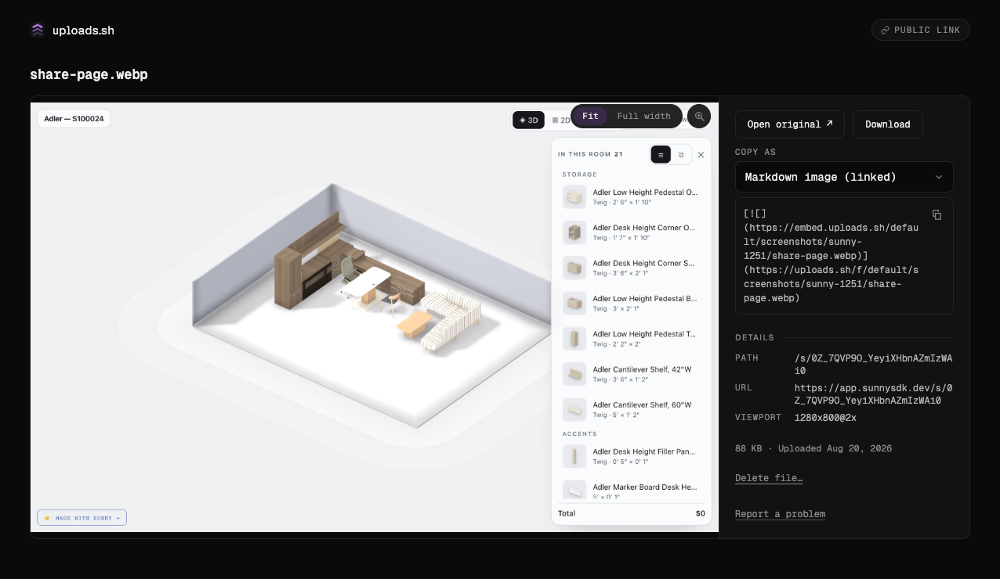

<div align="center">



<h1>uploads</h1>

**The missing upload command for coding agents.**

Capture screenshots as you work. When the pull request opens, uploads.sh puts
them in one tidy comment that updates automatically on each revision. Hosted
uploads.sh is free to start. Connect your own bucket — Cloudflare R2 or any
S3-compatible provider — so storage in that bucket is unmetered, or self-host
the open-source service.

<p>
  <a href="https://uploads.sh"><b>uploads.sh</b></a> &nbsp;·&nbsp;
  <a href="https://uploads.sh/docs"><b>Docs</b></a> &nbsp;·&nbsp;
  <a href="https://www.npmjs.com/package/@buildinternet/uploads"><b>npm →</b></a> &nbsp;·&nbsp;
  <a href="#quick-start">Quick start</a> &nbsp;·&nbsp;
  <a href="#what-it-looks-like">What it looks like</a> &nbsp;·&nbsp;
  <a href="#whats-in-this-repo">What's in this repo</a> &nbsp;·&nbsp;
  <a href="#local-development">Develop</a>
</p>

<p>
  <a href="https://skills.sh/buildinternet/uploads"></a>
  <a href="https://github.com/buildinternet/uploads/actions/workflows/ci.yml"></a>
  <a href="https://www.npmjs.com/package/@buildinternet/uploads"></a>
  <a href="https://registry.modelcontextprotocol.io/v0.1/servers?search=sh.uploads/mcp"></a>
  <a href="https://github.com/apps/uploads-sh"></a>
  <a href="https://deepwiki.com/buildinternet/uploads"></a>
  <a href="LICENSE"></a>
</p>

<p><sub>
  <b>Under active development.</b> uploads.sh is being built in the open, so
  APIs can still change. Feedback is welcome — open an issue.
</sub></p>

</div>

---

## Screenshots ready when the pull request opens

**uploads** hosts screenshots and other files at stable URLs that coding agents
can use in pull requests and issues. On a branch, `uploads put` stages each file
as soon as it is ready. When the pull request opens, uploads.sh promotes the
staged files into one managed comment.

GitHub's own attachments work from a browser and, since GitHub CLI 2.99
(September 2026), from `gh … --attach`, but only once a pull request or issue
exists, and the files stay private to GitHub. uploads.sh gives agents a stable
public URL from the same terminal where they build and test the change, while
the branch is still in progress.

Keys are hash-free, so re-uploading the same filename overwrites in place and
the URL never changes — every embed of it updates at once. Workspaces keep
tenants (and their budgets and key policies) apart.

This repo is the source of the canonical deployment at
[uploads.sh](https://uploads.sh): the API worker, auth worker, MCP server, the
Astro web app, and the `@buildinternet/uploads` CLI (published to npm from
[`packages/uploads`](packages/uploads)).

## What it looks like

One comment per PR, rewritten in place on every sync. Files tagged
`--state before` and `--state after` pair into a side-by-side table; anything
else lands below it.

<div align="center">
  <a href="https://github.com/buildinternet/uploads/pull/436#issuecomment-5052307515"></a>
</div>

<sub>The real comment on
[#436](https://github.com/buildinternet/uploads/pull/436#issuecomment-5052307515).</sub>

Pairing is by `--meta path=…` when several pairs share a comment (one `before`
and one `after` per path), and falls back to filenames that differ only by a
`before`/`after` token — `hero-before.webp` with `hero-after.webp`.

Everything you attach also lands in your workspace, grouped by where it came
from — pages by `path`, projects by `repo` or `app` — and browsable from one
place.

<div align="center">
  
</div>

<sub>The screenshots view groups uploads by project and path.</sub>

Open any file for a share page: copy-ready embeds (Markdown, HTML, and more),
the raw URL, and a delete button.

<div align="center">
  
</div>

<sub>Each file's share page — copy-ready embeds, details, and delete.</sub>

## Quick start

Install the CLI and sign in once:

```bash
npm install --global @buildinternet/uploads
uploads login
```

Upload a file and tag the page it shows:

```bash
uploads put ./settings.png --meta path=/settings
```

On a branch, `put` stages the file automatically. Open the pull request however
you normally would. The [GitHub App](https://uploads.sh/docs/github-app)
promotes the staged files into one managed attachments comment.

## More ways to upload

Use the same commands for before-and-after evidence, an open pull request, a
browser capture, or an annotated image:

```bash
# Pair two states from the same page in the pull request comment.
uploads put ./before.png --meta path=/settings --state before
uploads put ./after.png --meta path=/settings --state after

# See what this branch will attach when the pull request opens.
uploads staged

# Attach files directly when a pull request or issue is already open.
uploads attach ./before.png ./after.png

# Capture, annotate, and upload a page in one command.
uploads screenshot http://localhost:4321/settings --via local --annotate ./callouts.json
```

`attach` detects the repository and current PR through `gh`, uploads all files,
and creates or updates that same one comment. Without the GitHub App, run
`uploads attach --promote` after opening the pull request to promote files that
you staged earlier. All commands run under `npx @buildinternet/uploads …`
without a global install.

Sign in with GitHub or a magic link, then create your own workspace or accept
an invite into one — see [enrollment](docs/enrollment.md). Hosted files are
public URLs — private-repo attachments get non-guessable links
([how that works](docs/private-attachments.md)), but anyone holding a URL can
view the file. Do not upload secrets or sensitive UI.

## Connect your agent

The hosted MCP server runs at `https://agents.uploads.sh/mcp` and is listed in the
[MCP Registry](https://registry.modelcontextprotocol.io/v0.1/servers?search=sh.uploads/mcp)
as `sh.uploads/mcp`. Local stdio is `uploads mcp` on the same npm package.

```bash
# Claude Code
claude mcp add --transport http uploads https://agents.uploads.sh/mcp

# Codex
codex mcp add uploads --url https://agents.uploads.sh/mcp

# OpenCode
opencode mcp add uploads --url https://agents.uploads.sh/mcp
```

`uploads install` adds the agent skills and the MCP server, so future sessions
can capture each visual milestone without being asked. The skills also install
standalone into any agent runtime:

```bash
npx skills add buildinternet/uploads
```

That installs three skills: `github-screenshots` (visuals → PRs/issues),
`uploads-cli` (full CLI reference), and `annotate-screenshots` (callouts and
redaction on a capture).

Full CLI usage, including annotations, managed comments, and public galleries,
lives in [docs/cli.md](docs/cli.md).
REST routes are in [docs/api.md](docs/api.md).

## What's in this repo

| Path                              | What                                                                                                                                                            |
| --------------------------------- | --------------------------------------------------------------------------------------------------------------------------------------------------------------- |
| `apps/`                           | The deployables: the REST API worker (`api.uploads.sh`), the auth worker, the remote MCP server, and the Astro site at uploads.sh                               |
| `packages/`                       | Shared code — most notably `@buildinternet/uploads` (the CLI, published to npm) and `@uploads/storage` (the files-sdk adapter factory all storage goes through) |
| `skills/`                         | The three agent skills that ship to users                                                                                                                       |
| `hooks/`, `plugins/`, `.mcp.json` | Agent-runtime wiring: the shared pre-PR screenshot hook and the Claude / Codex plugin manifests                                                                 |
| `server.json`                     | MCP Registry listing (`sh.uploads/mcp`): stdio `uploads mcp` plus the hosted remote                                                                             |

Each worker and the web app deploy separately. All storage access goes through
`createStorage()` in `packages/storage` — adding a provider is one new case
plus peer deps, no API changes.

## Docs

Product docs — install, the staged loop, the GitHub App, limits — live at
https://uploads.sh/docs. The docs in this repo are the companion: CLI and API
reference, contributor setup, and operator material, all mapped from
[docs/README.md](docs/README.md).

How to set up, test, and open a pull request: [CONTRIBUTING.md](CONTRIBUTING.md).
Where the project is headed: [VISION.md](VISION.md). Agent working conventions
live in [AGENTS.md](AGENTS.md), and agents that land on this repo should start
at [llms.txt](llms.txt). The product site serves https://uploads.sh/llms.txt
and https://uploads.sh/llms-full.txt.

## Local development

**Prerequisites:** Node ≥24 and pnpm ≥11 (`corepack enable`). No Cloudflare
account needed for the core local loop — `wrangler dev` simulates R2, KV, and
D1 on disk:

```bash
pnpm bootstrap        # one-command setup: tooling, deps, env vars, local D1, default workspace
pnpm dev              # API on :8787 (local R2 + KV + D1)
```

`bootstrap` is idempotent, and `pnpm doctor` diagnoses a setup without changing
it. The rest of the loop — the authenticated dev stack, the check and test
gates, and how to open a pull request — is in
[CONTRIBUTING.md](CONTRIBUTING.md).

## License

[Apache 2.0](LICENSE).
